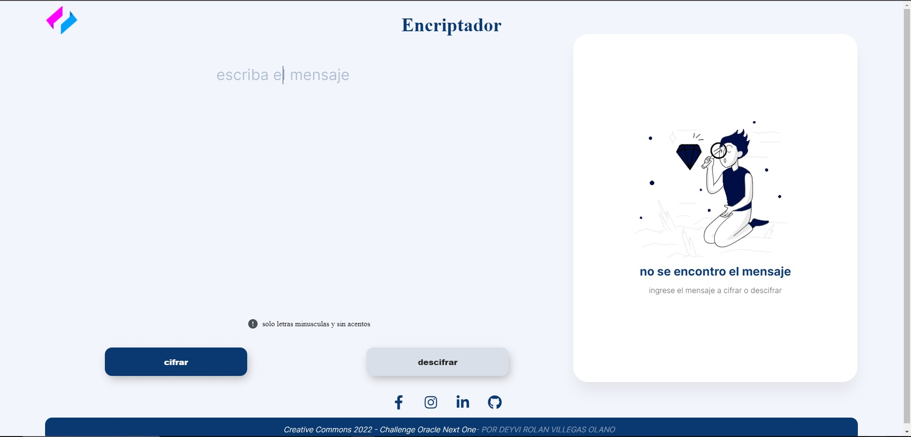

# 🔏 Descifrador de texto

     

    
    
    

## 🔗Links

Pagina : [Github-Pages](https://arcesoftware.github.io/Challenge-Oracle-One/)

## 📃Resume del projecto

Este es el primer Challenge del programa ONE - Oracle Next Education. Esta aplicación tiene la función de codificar y decodificar mensajes de texto de forma sencilla. Con el objetivo de intercambiar información con otras personas de una manera segura y divertida.

## 🔑Llaves de encriptacion

Las "llaves" de encriptación que se utilizaron son las siguiente:

- La letra **"e"** es convertida para **"enter"**
- La letra **"i"** es convertida para **"imes"**
- La letra **"a"** es convertida para **"ai"**
- La letra **"o"** es convertida para **"ober"**
- La letra **"u"** es convertida para **"ufat"**

**Aplica también a la inversa**

## 📋Requisitos:

- Debe funcionar solo con letras minúsculas.
- No deben ser utilizados letras con acentos ni caracteres especiales.
- Un botón que copie el texto encriptado/desencriptado para la sección de transferencia.
- Debe ser posible convertir una palabra para la versión encriptada también devolver una palabra encriptada para su versión original.
- La página debe tener campos para inserción del texto que será encriptado o desencriptado, y el usuario debe poder escoger entre as dos opciones.
- El resultado debe ser mostrado en la pantalla.

` Por ejemplo: "gato" => "gaitober" "gaitober" => "gato"`

- La página debe tener campos para inserción del texto que será encriptado o desencriptado, y el usuario debe poder escoger entre as dos opciones.
- El resultado debe ser mostrado en la pantalla.

### Extras:

- Un botón que copie el texto encriptado/desencriptado para la sección de transferencia, o sea que tenga la misma funcionalidad del ctrl+C o de la opción "copiar" del menú de las aplicaciones.
